<p align="center">
  
</p>

<h1 align="center">ShopCar 🚗🛒</h1>

<p align="center">
  <strong>A modern, secure, and responsive authentication system built with Laravel</strong>
</p>

<p align="center">
  <a href="https://laravel.com" target="_blank"></a>
  <a href="https://www.php.net" target="_blank"></a>
  
  
</p>

## 🌟 Project Overview

**ShopCar** is a Laravel-based web application built as a **university project**.  
Its main purpose is to demonstrate a **full authentication flow** with a modern, clean interface and email notifications.

The project covers:

- Secure **user registration**
- **Login system** with hashed passwords
- **Profile management**
- **Email notifications** on login and registration
- Clean and responsive **Blade UI templates**
- SQLite database for easy setup

## 🚀 Features

- **User Registration:** Email + Password  
- **Login & Logout** functionality  
- **Profile Page:** Shows user's account info  
- **Email Notifications:** Sent on registration and login  
- **Password Hashing:** Security best practices  
- **CSRF Protection:** Secure forms  
- **Responsive UI:** Works on mobile and desktop  

## 📸 Screenshots

### Welcome Page
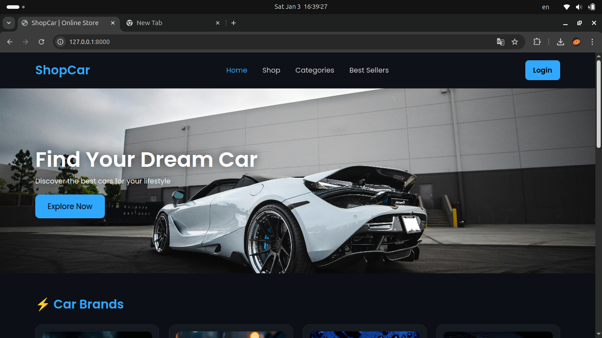

### Welcome Page
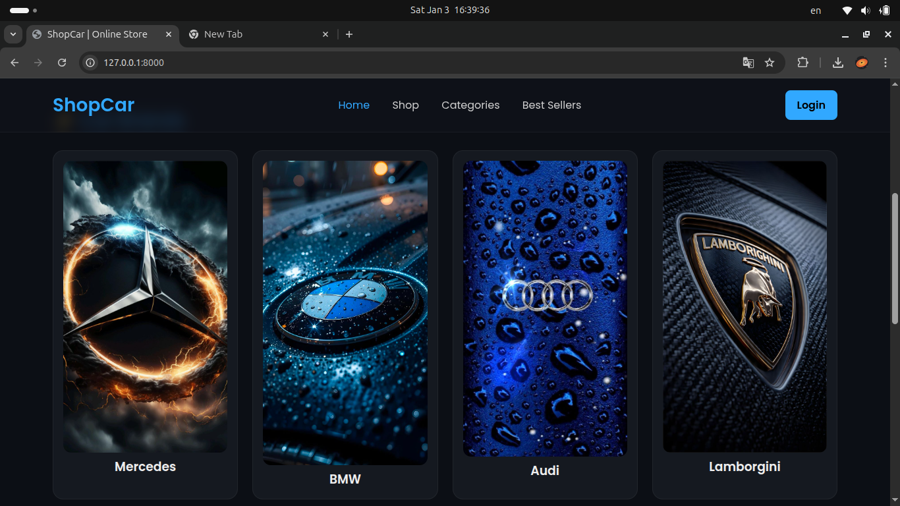

### Welcome Page
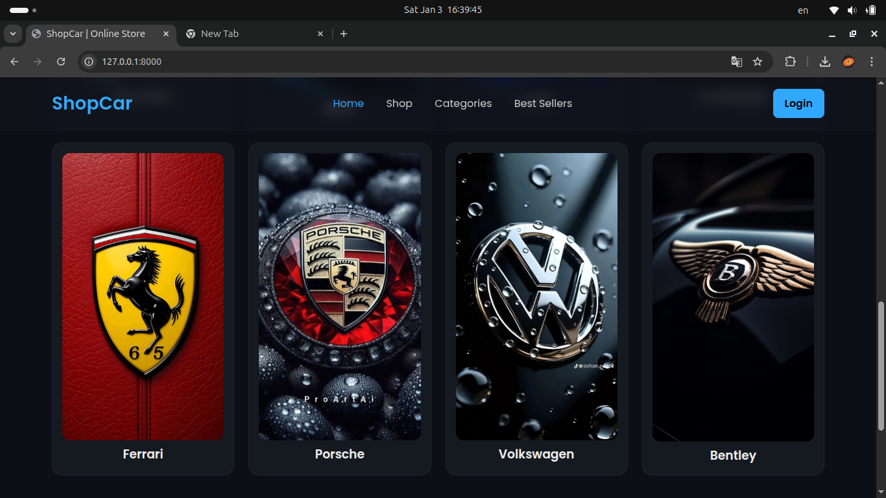

### Login Page
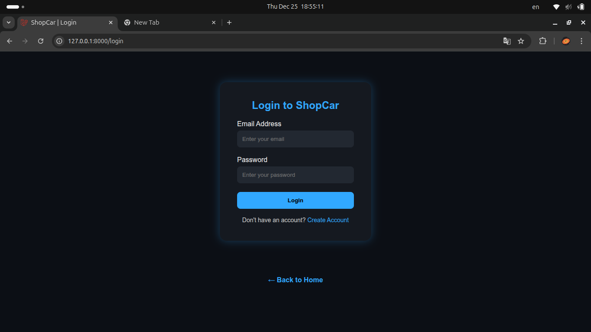

### Register Page
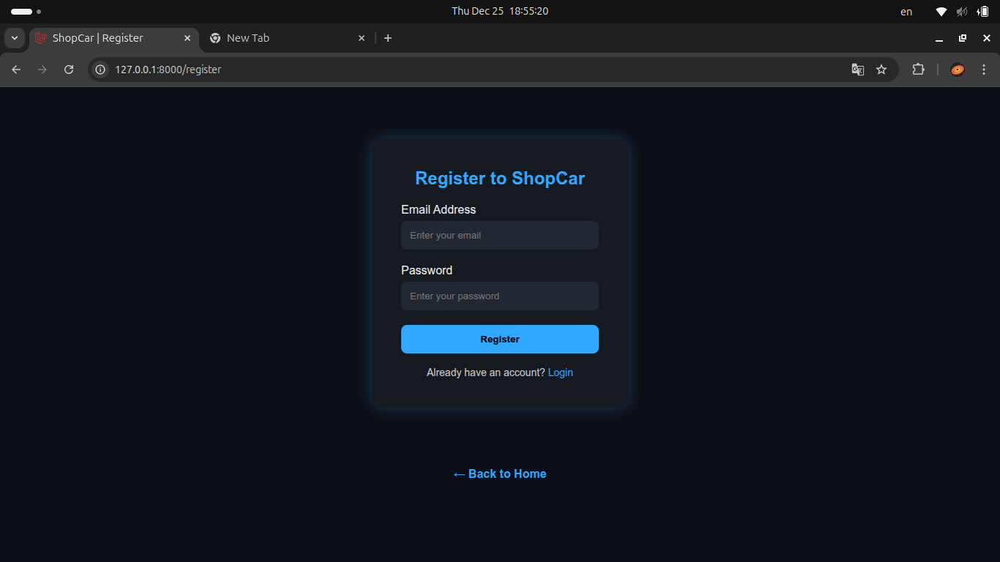

### Profile Page
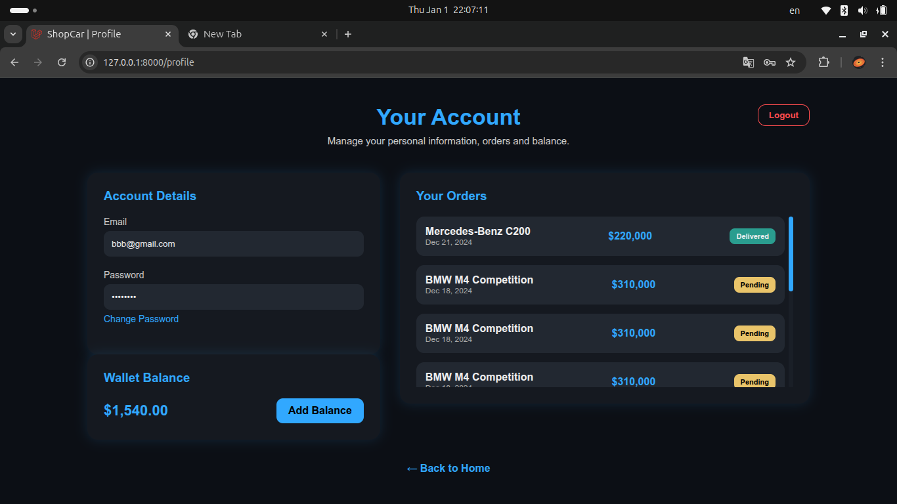

### Add Balance Page
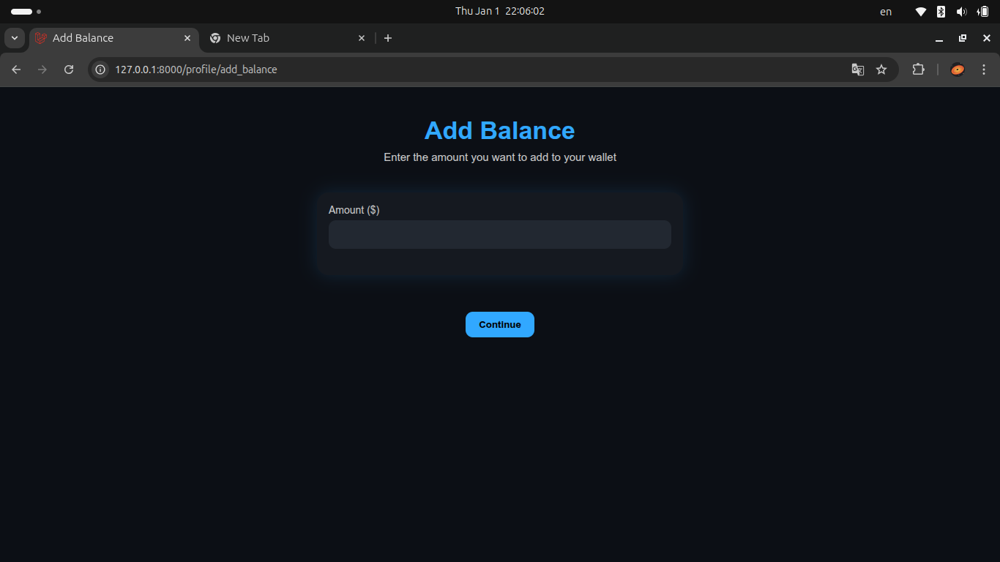

### Add Balance Confirm Page
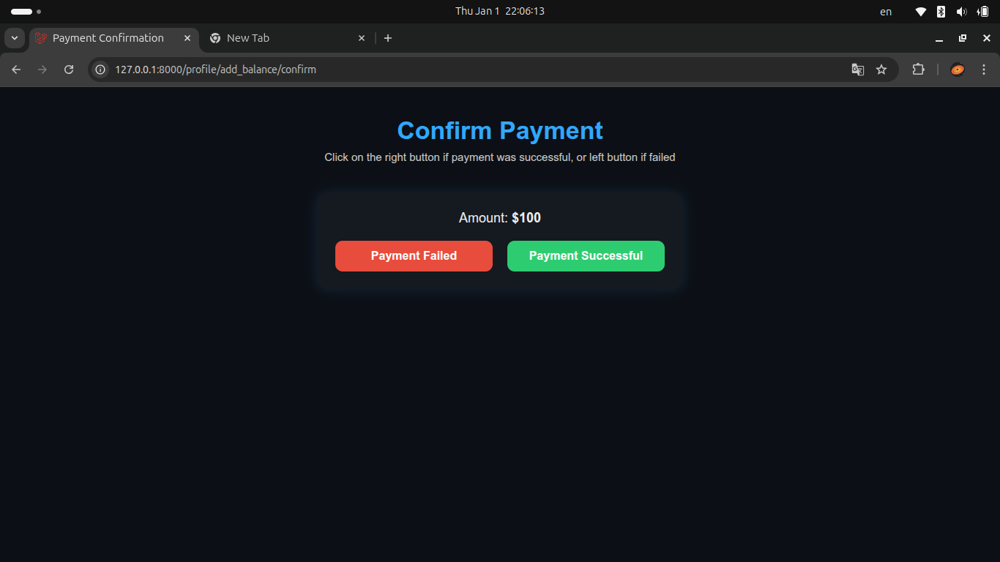

### Admin Page
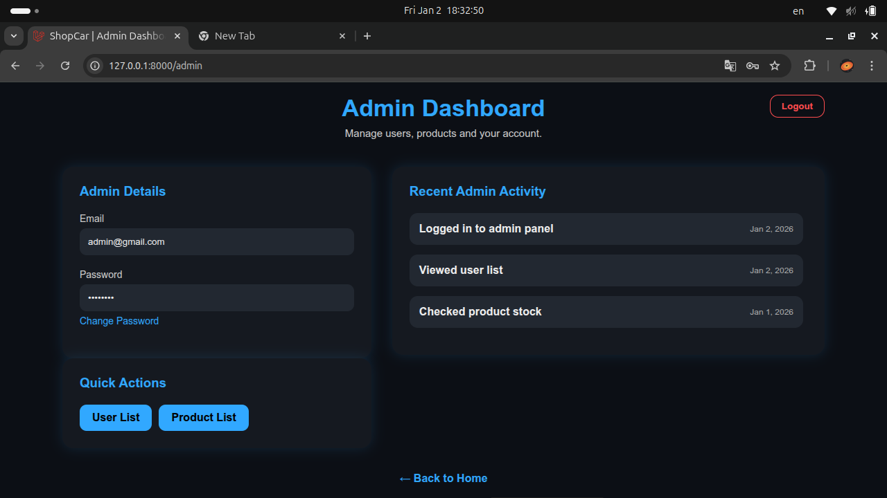

### Users List Page
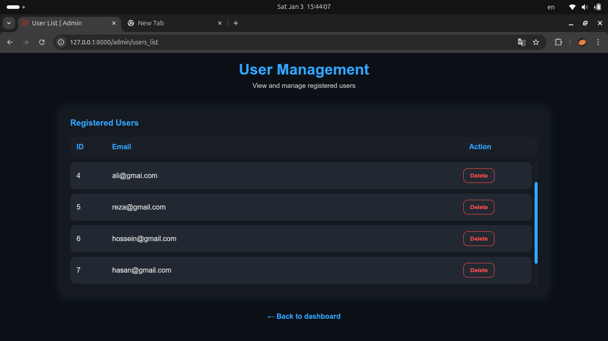

### Prpduct List Page
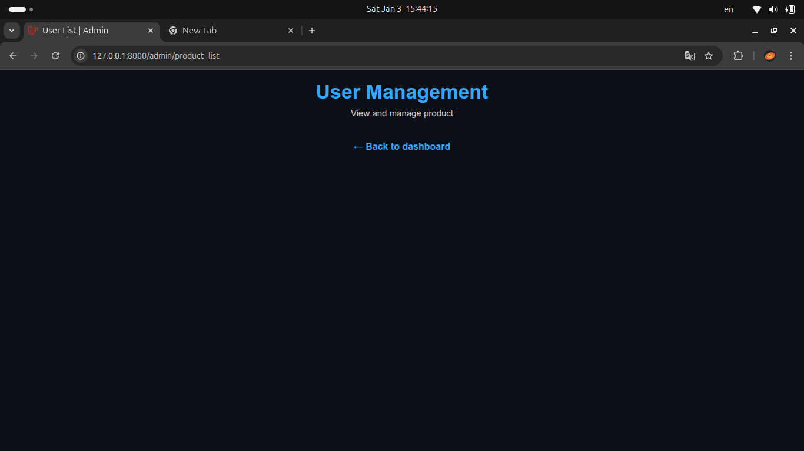

## 🛠️ Tech Stack

- **Framework:** Laravel 10  
- **Backend Language:** PHP 8.3  
- **Frontend:** Blade + CSS  
- **Database:** SQLite  
- **Email:** Gmail SMTP / Log Driver for testing  

## ⚙️ Installation & Setup

1. Clone the repository:
```bash
git clone https://github.com/your-username/shopcar.git
cd shopcar
```

2. Install dependencies:
```bash
composer install
```

3. Setup environment file:
```bash
cp .env.example .env
php artisan key:generate
```

4. Run migrations (this will reset database):
```bash
php artisan migrate:fresh
```

5. Start the development server:
```bash
php artisan serve
```

6. Access the app:
```
http://127.0.0.1:8000
```

## 📧 Email Configuration

**For testing (no real email sent):**
```env
MAIL_MAILER=log
```

**For real Gmail notifications:**
```env
MAIL_MAILER=smtp
MAIL_HOST=smtp.gmail.com
MAIL_PORT=587
MAIL_USERNAME=your_gmail@gmail.com
MAIL_PASSWORD=your_app_password
MAIL_ENCRYPTION=tls
MAIL_FROM_ADDRESS=your_gmail@gmail.com
MAIL_FROM_NAME="ShopCar"
```

> ⚠️ Make sure **2-step verification** is enabled on your Gmail account  
> and you generate an **App Password** for Laravel to send emails.

## 🔒 Security Features

- Passwords stored with **bcrypt hashing**
- CSRF protection for all forms
- Input validation for email and password
- Unique email enforcement
- No plain text credentials stored

## 🎓 Academic Notes

This project demonstrates:

- Laravel MVC architecture  
- Authentication flow  
- Email notifications integration  
- Database migrations & Eloquent ORM  
- Secure web application development

## 💡 Future Improvements

- Add **password reset** functionality  
- Add **email verification**  
- Implement **user roles & permissions**  
- Enhance **UI/UX with Tailwind CSS or Bootstrap**  
- Add **multi-language support**

## 📜 License

This project is open-source and **developed for educational purposes** under the [MIT License](https://opensource.org/licenses/MIT).

<p align="center">
  Made with ❤️ using Laravel & PHP
</p>
